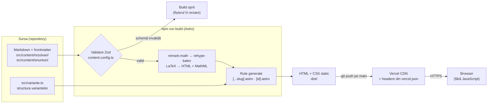
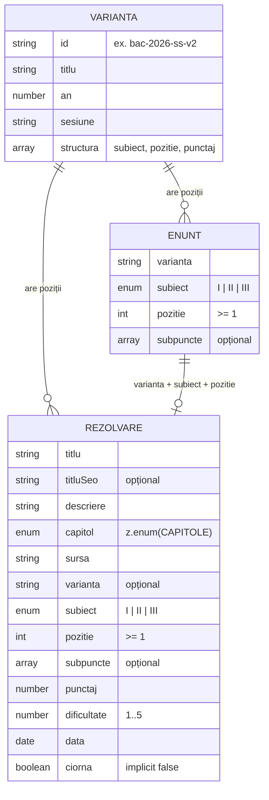
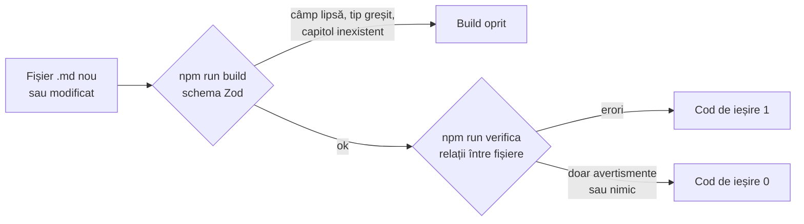

# Mate cu Isa

**Rezolvări comentate pas cu pas la variantele oficiale de bacalaureat la matematică, programa M_mate-info.**

**Demo live:** [matecuisa.vercel.app](https://matecuisa.vercel.app)


---

## Cuprins

1. [Despre proiect](#1-despre-proiect)
2. [Funcționalități](#2-funcționalități)
3. [Stack tehnic](#3-stack-tehnic)
4. [Arhitectură](#4-arhitectură)
5. [Modelul de conținut](#5-modelul-de-conținut)
6. [Validare automată](#6-validare-automată)
7. [Securitate și performanță](#7-securitate-și-performanță)
8. [SEO](#8-seo)
9. [Accesibilitate și design](#9-accesibilitate-și-design)
10. [Rulare locală](#10-rulare-locală)
11. [Publicare](#11-publicare)
12. [Structura proiectului](#12-structura-proiectului)
13. [Convenții de redactare](#13-convenții-de-redactare)
14. [Decizii tehnice asumate și pași următori](#14-decizii-tehnice-asumate-și-pași-următori)

---

## 1. Despre proiect

### Problema

Rezolvările la subiectele de bac se găsesc ușor. Ce lipsește de obicei e partea
dintre enunț și rezultat: de unde îți dai seama ce metodă se folosește, ce
simplificări se fac și de ce, unde se pierd puncte la barem și ce anume trebuie
scris pe foaie ca să primești punctajul.

### Soluția

Fiecare problemă dintr-o variantă oficială are pagina ei:

- enunțul **transcris exact** din subiectul oficial;
- rezolvarea **pas cu pas**, cu toate simplificările intermediare;
- **capcanele de barem**, semnalate exact acolo unde apar;
- metodele alternative pe care baremul le acceptă;
- separat, într-o casetă, **ce se scrie efectiv pe foaie** pentru punctaj.

Conținutul e deschis și indexabil. Nu e o platformă cu conturi, ci un site
static de conținut, cu o pagină de contact pentru meditații 1 la 1.

---

## 2. Funcționalități

### Pagina unei rezolvări (`/rezolvari/<slug>/`)
- **Etichete**: capitolul din programă, sursa (varianta și poziția), punctajul din barem și dificultatea
- **Cuprins al subpunctelor** a), b), c), cu ancore, la problemele de 15 puncte
- **Enunțul oficial**, preluat automat din colecția `enunturi`, nu copiat în articol
- **Pașii rezolvării**, cu observații pedagogice (`aside`), capcane de barem (`atentie`), metode alternative (`alternativa`), tabele de variație și desene SVG la geometrie
- **Caseta „Ce scrii efectiv pe foaie”** (`pe-foaie`), separată de explicații
- **Greșelile frecvente**, la finalul articolului
- **Navigare în variantă**: problema anterioară și cea următoare, în ordinea din subiect, plus un link înapoi la variantă
- **Invitația la meditații**, la final, cu email și WhatsApp

### Paginile de variante (`/variante/` și `/variante/<id>/`)
- O pagină pentru fiecare dintre cele **10 variante** definite în `src/variante.ts`
- Pozițiile sunt grupate pe Subiectele I, II și III, cu punctajul fiecăreia
- Pozițiile rezolvate au link, cele nerezolvate sunt marcate „în curând”
- Un contor „X din Y poziții rezolvate”, calculat la build

### Lista rezolvărilor (`/rezolvari/`)
- Toate rezolvările publicate, grupate pe capitole și sortate alfabetic, cu regulile de sortare ale limbii române

### Pagina de meditații (`/meditatii/`)
- Tariful, durata și formatul, citite din `src/config.ts`
- Contact prin `mailto:` și prin link WhatsApp cu mesaj precompletat. Fără formular, deci fără date trimise către un server.

### Pagina „Cine este Isa” (`/despre/`)

---

## 3. Stack tehnic

Stack-ul a fost ales intenționat **minimal**: conținutul e text cu formule, deci
tot ce se poate calcula dinainte se calculează la build.

| Tehnologie | Rol în proiect | De ce |
|---|---|---|
| **[Astro 5](https://astro.build)** | Generator de site static | Build-ul produce HTML pur. Site-ul publicat nu conține niciun fișier JavaScript. |
| **Astro Content Collections + [Zod](https://zod.dev)** | Conținutul din Markdown, validat la build | Frontmatter-ul are o schemă: un câmp lipsă sau un capitol scris greșit oprește build-ul, cu numele fișierului în eroare |
| **[remark-math](https://github.com/remarkjs/remark-math) + [rehype-katex](https://github.com/remarkjs/remark-math)** | Transformă `$...$` și `$$...$$` din Markdown în HTML | Formulele se scriu în LaTeX direct în articol, fără componente speciale |
| **[KaTeX](https://katex.org)** | Randarea matematicii | Rulează la build, nu în browser: pagina ajunge la elev cu formulele deja compuse |
| **CSS scris de mână** | Tot designul, în `src/styles/global.css` | Culorile și fonturile sunt variabile pe `:root`. Fără framework de stilizare. |
| **Node.js** | Scriptul propriu de verificare (`scripts/verifica.mjs`) | Verifică relațiile dintre fișiere, pe care schema nu le vede |
| **Vercel** | Găzduire statică, CDN, HTTPS, headere HTTP, deploy din GitHub | Fiecare `git push` pe `main` publică automat site-ul |

Dependențele de producție sunt exact patru (`package.json`): `astro`, `katex`,
`rehype-katex`, `remark-math`.

---

## 4. Arhitectură



**Principiul de bază:** tot ce se poate face o dată, la build, nu se mai face
în browserul fiecărui elev. Formulele, listele, contoarele și legăturile dintre
pagini sunt calculate la build, iar pe server ajung doar fișiere statice.

---

## 5. Modelul de conținut

Conținutul stă în două colecții separate, definite în `src/content.config.ts`,
plus lista variantelor din `src/variante.ts`.



### Colecția `rezolvari`

| Câmp | Tip | Rol |
|---|---|---|
| `titlu` | text | Titlul din pagină |
| `titluSeo` | text, opțional | Ce apare în `<title>` și în Google, dacă diferă de titlu |
| `descriere` | text | Meta description |
| `capitol` | `z.enum(CAPITOLE)` | Unul dintre cele 17 capitole din programa M_mate-info |
| `sursa` | text | De exemplu „BAC 2026, sesiunea iunie, Subiectul II.1” |
| `varianta` | text, opțional | Id-ul variantei din `src/variante.ts`. Lipsește la problemele care nu vin dintr-o variantă. |
| `subiect` | `'I' \| 'II' \| 'III'` | Subiectul |
| `pozitie` | întreg ≥ 1 | Poziția în subiect |
| `subpuncte` | listă de texte, opțional | Titlurile subpunctelor. Ordinea dă literele a, b, c. |
| `punctaj` | număr | Punctele din barem |
| `dificultate` | 1–5 | Afișată ca „ușoară”, „medie”, „grea”, „foarte grea” |
| `data` | dată | Folosită pentru „Rezolvări recente” pe prima pagină |
| `ciorna` | boolean, implicit `false` | `true` ține articolul nepublicat |

### Colecția `enunturi`

Un fișier pentru fiecare poziție, cu `varianta`, `subiect`, `pozitie` și,
opțional, `subpuncte`. Corpul fișierului e enunțul oficial, transcris cuvânt cu
cuvânt.

### Ce am făcut și de ce

- **Enunțurile sunt separate de rezolvări.** Se transcriu și se verifică o
  singură dată pe variantă. Layout-ul `Rezolvare.astro` le găsește după cheia
  **`varianta + subiect + pozitie`** și le afișează deasupra rezolvării. Dacă
  enunțul lipsește, pagina afișează un mesaj care spune exact ce fișier trebuie
  adăugat.
- **`capitol` e un `z.enum`, nu text liber.** Lista oficială de capitole e în
  `CAPITOLE`, în ordinea din subiecte. O etichetă scrisă greșit („Limite
  șiruri” în loc de „Limite de șiruri”) oprește build-ul, deci lista de pe
  `/rezolvari/` nu se poate fragmenta în capitole aproape identice.
- **Punctajul unei poziții stă în `src/variante.ts`**, în structura variantei:
  Subiectul I are 6 itemi a 5 puncte, Subiectele II și III au câte 2 itemi a
  15 puncte (90 de puncte din lucrare și 10 din oficiu).

---

## 6. Validare automată

Validarea are două straturi, pentru că există două feluri de erori.



### Ce verifică schema (`npm run build`)

Fiecare fișier, luat separat: câmpurile obligatorii există, tipurile sunt
corecte, `capitol` e unul dintre cele 17 capitole, `subiect` e `I`, `II` sau
`III`, `pozitie` e un întreg pozitiv, `dificultate` e între 1 și 5.

### Ce verifică `npm run verifica` (`scripts/verifica.mjs`)

Relațiile **dintre** fișiere și regulile de redactare, pe care schema nu le
vede. Fișierele care încep cu `_` (șablonul) sunt ignorate.

| # | Verificare | Nivel |
|---|---|---|
| 1 | Rezolvarea are enunțul transcris (după `varianta + subiect + pozitie`) | eroare |
| 2 | Nu există două rezolvări publicate pentru aceeași poziție | eroare |
| 3 | Numărul de subpuncte din frontmatter e egal cu numărul de marcaje din text, iar marcajele sunt în ordinea a, b, c… | eroare |
| 4 | O problemă de 15 puncte are subpuncte declarate | avertisment |
| 5 | Există caseta „Ce scrii efectiv pe foaie” (`pe-foaie`) | avertisment |
| 6 | Problemele de geometrie analitică și trigonometrie de la Subiectul I au desen | avertisment |
| 7 | Un text care discută monotonia are tabel de variație | avertisment |
| 8 | Baremul variantei există în `bareme/` | avertisment |
| 9 | Descrierea are cel puțin 70 de caractere, ca să fie utilă în Google | avertisment |
| 10 | `$$...$$` nu e scris pe un singur rând (ar ieși matematică în rând, nu centrată) | eroare |
| 11 | După deschiderea unui `<div>` există rând gol (altfel conținutul nu mai e parsat ca Markdown) | eroare |
| 12 | Fiecare enunț transcris are o rezolvare | avertisment |

La final, scriptul afișează numărul de rezolvări publicate și de enunțuri, apoi
erorile și avertismentele. Iese cu cod **`1`** dacă există cel puțin o eroare și
cu **`0`** dacă există doar avertismente sau nimic, deci poate fi pus într-un
hook de commit sau într-un pas de CI.

Folderele `bareme/` și `subiecte/` (PDF-urile oficiale) nu sunt în repository,
deci pe o clonă nouă verificarea 8 dă avertismente.

---

## 7. Securitate și performanță

### Suprafață de atac minimă

Site-ul publicat e un folder de fișiere HTML și CSS. Nu are backend, bază de
date, conturi, formulare sau cookie-uri, iar în `dist/` nu există niciun
fișier JavaScript. Nu există server care să cadă și nici date care să fie
furate. Contactul se face prin `mailto:` și prin link WhatsApp.

### Headere HTTP (`vercel.json`)

Aplicate pe toate rutele:

| Header | Valoare / efect |
|---|---|
| `X-Frame-Options` | `DENY`: site-ul nu poate fi încadrat în alt site (protecție la clickjacking) |
| `X-Content-Type-Options` | `nosniff`: browserul nu ghicește tipul fișierelor |
| `Referrer-Policy` | `strict-origin-when-cross-origin`: site-urile externe văd doar domeniul, nu adresa completă a paginii |
| `Strict-Transport-Security` | `max-age=31536000`: HTTPS obligatoriu timp de un an |

### Performanță

- **Formulele sunt randate la build.** KaTeX nu rulează în browser, deci
  pagina nu așteaptă niciun script ca să afișeze matematica.
- **Zero JavaScript trimis către client.** Singurele resurse sunt HTML, CSS și
  fonturi.
- **Imaginea de pe pagina „Despre”** e optimizată la build de `astro:assets`,
  în mai multe dimensiuni WebP.
- **Formulele lungi și tabelele de variație au scroll orizontal propriu**, deci
  nu lățesc pagina pe telefon.

---

## 8. SEO

Numele fișierului Markdown devine adresa paginii, deci e ales după cuvintele pe
care le-ar căuta cineva pe Google:

```
src/content/rezolvari/ecuatie-logaritmica-schimbare-de-baza-simulare-2026.md
→ https://matecuisa.vercel.app/rezolvari/ecuatie-logaritmica-schimbare-de-baza-simulare-2026/
```

- **`<title>`** vine din `titluSeo` (sau din `titlu`, dacă `titluSeo` lipsește), iar **meta description** vine din `descriere`
- **Link canonic** pe fiecare pagină, construit din `site` din `astro.config.mjs`
- **Open Graph** (`og:title`, `og:description`, `og:type`) pe fiecare pagină
- **`<html lang="ro">`**
- **Pagini de listă** (`/rezolvari/` grupată pe capitole, `/variante/<id>/`) care prind căutările mai largi și trimit spre rezolvările individuale
- `npm run verifica` avertizează când o descriere e prea scurtă pentru rezultatele Google

---

## 9. Accesibilitate și design

- **Mobil întâi.** Majoritatea elevilor citesc pe telefon. Layout-ul se adaptează prin media queries, iar formulele lungi și tabelele de variație au scroll propriu.
- **Coloana de text** are ~65 de caractere (`--measure: 34rem`), cu text de 18px și spațiere de 1.72 între rânduri
- **Serif pentru conținut** (Spectral, potrivit cu KaTeX), sans pentru navigație și etichete (Archivo), mono pentru cod (IBM Plex Mono)
- **Toate culorile și fonturile sunt variabile CSS** pe `:root` (`--ink`, `--accent`, `--rule`, `--serif`, `--sans`, `--mono`, `--measure`). Desenele SVG folosesc aceleași variabile, prin clase, fără culori scrise în SVG.
- **Desenele de geometrie** au `role="img"`, `aria-label` cu descrierea figurii și un `<figcaption>`
- **Tabelele de variație** folosesc HTML (`<table class="variatie">`), cu capete de rând. Nu sunt imagini.
- **KaTeX** generează și MathML alături de HTML, pe care cititoarele de ecran îl pot citi
- **Navigația** marchează pagina curentă cu `aria-current="page"`. Cuprinsul subpunctelor și navigarea între probleme sunt `<nav>` cu `aria-label`.
- **Animațiile decorative** rulează doar cu `prefers-reduced-motion: no-preference`
- **Imaginea autoarei** are text alternativ

---

## 10. Rulare locală

**Cerințe:** Node.js în versiunea cerută de Astro 5 (18.17.1+, 20.3+ sau 22+).

```bash
git clone https://github.com/Isabela-Maria-Andreea/Mate-cu-Isa_.git
cd Mate-cu-Isa_
npm install
```

```bash
npm run dev       # http://localhost:4321, cu hot reload
npm run build     # generează dist/
npm run preview   # servește dist/ local
npm run verifica  # verifică integritatea conținutului
```

După orice modificare de conținut se rulează **amândouă**: `npm run build`
(erori de schemă) și `npm run verifica` (relații stricate între fișiere).

---

## 11. Publicare

Site-ul e găzduit pe **Vercel**, legat de acest repository de pe GitHub. Fiecare
`git push` pe `main` declanșează un build nou și publică automat site-ul.

| Setare | Valoare |
|---|---|
| Framework | Astro (detectat automat) |
| Comanda de build | `npm run build` |
| Folderul de ieșire | `dist` |
| Adresa publică | [matecuisa.vercel.app](https://matecuisa.vercel.app) |
| Headere HTTP | `vercel.json` |

Adresa publică e setată și în `astro.config.mjs` (`site`), de unde se construiesc
linkurile canonice.

---

## 12. Structura proiectului

```
Mate-cu-Isa_/
├── src/
│   ├── content/
│   │   ├── rezolvari/        # articolele (Markdown + frontmatter); _sablon.md e șablonul
│   │   └── enunturi/         # enunțurile oficiale, transcrise exact
│   ├── content.config.ts     # schemele Zod și lista de capitole
│   ├── layouts/
│   │   ├── Base.astro        # cadrul paginii: head, nav, footer
│   │   └── Rezolvare.astro   # pagina unei rezolvări
│   ├── components/
│   │   ├── Contact.astro     # invitația la meditații de la finalul rezolvărilor
│   │   └── IconWhatsapp.astro
│   ├── pages/
│   │   ├── index.astro
│   │   ├── despre.astro
│   │   ├── meditatii/index.astro
│   │   ├── rezolvari/
│   │   │   ├── index.astro         # lista, grupată pe capitole
│   │   │   └── [...slug].astro     # o pagină per rezolvare
│   │   └── variante/
│   │       ├── index.astro
│   │       └── [id].astro          # o pagină per variantă de bac
│   ├── assets/               # imaginea de pe pagina „Despre”
│   ├── styles/global.css     # tot CSS-ul; culorile și fonturile ca variabile
│   ├── config.ts             # date de contact, tarif, locuri disponibile
│   └── variante.ts           # variantele de bac și structura lor pe poziții
├── scripts/
│   └── verifica.mjs          # verificatorul de conținut
├── astro.config.mjs          # adresa site-ului, remark-math, rehype-katex
├── vercel.json               # headerele de securitate
└── package.json
```

---

## 13. Convenții de redactare

Matematica afișată se scrie cu `$$` pe **linii separate**:

```
$$
a_n = \sqrt{n^2 + 3n + 2} - n
$$
```

În rând se scrie cu un singur dolar: `$n \ge 1$`.

În interiorul unui `<div>` trebuie **rând gol** după deschidere și înainte de
închidere, altfel textul nu mai e citit ca Markdown:

```html
<div class="aside">

Text cu $matematică$ aici.

</div>
```

Clase disponibile în articole: `enunt`, `enunt-eticheta`, `aside`,
`pas` / `pas-n` / `pas-c`, `punct`, `rezultat`, `greseala`, `pe-foaie`,
`alternativa`, `atentie`, `variatie`, `desen`. Șablonul complet:
`src/content/rezolvari/_sablon.md`.

Explicația pedagogică stă în afara casetei `pe-foaie`; caseta conține exact ce
se scrie pe foaie pentru punctaj. `ciorna: true` în frontmatter ține un articol
nepublicat.

---

## 14. Decizii tehnice asumate și pași următori

**Decizii asumate**
- **Fără conturi, autentificare, bază de date, plăți, abonamente, corectare
  automată sau analytics de la terți.** E o alegere, nu o lipsă: scopul e
  conținut care se încarcă instant pe telefon și pe care Google îl indexează,
  nu o platformă de întreținut. Dacă va fi vreodată nevoie de conturi, se
  adaugă peste, fără să se rescrie nimic.
- **Fără exerciții propuse sau probleme similare.** Site-ul publică rezolvări
  la variante oficiale. Antrenamentul se face la meditații.
- **Fonturile se încarcă de pe Google Fonts.** E singura cerere către un
  serviciu extern.

**Pași următori**
- [ ] Domeniu propriu (`matecuisa.ro`), apoi actualizarea lui `site` din `astro.config.mjs` și a emailului din `src/config.ts`
- [ ] Mai multe variante rezolvate complet
- [ ] Căutare în rezolvări
- [ ] Sitemap (`@astrojs/sitemap`) și `robots.txt`
- [ ] `Content-Security-Policy` și `Permissions-Policy` în `vercel.json`
- [ ] Stil de focus vizibil pentru navigarea de la tastatură
- [ ] Fonturi găzduite local
- [ ] `npm run verifica` rulat automat în GitHub Actions la fiecare push

---

**Autor:** Andreea Maria Isabela Maria, studentă în anul II, Facultatea de Automatică și Calculatoare (UPB), specializarea Automatică și Informatică Aplicată · [GitHub](https://github.com/Isabela-Maria-Andreea)
